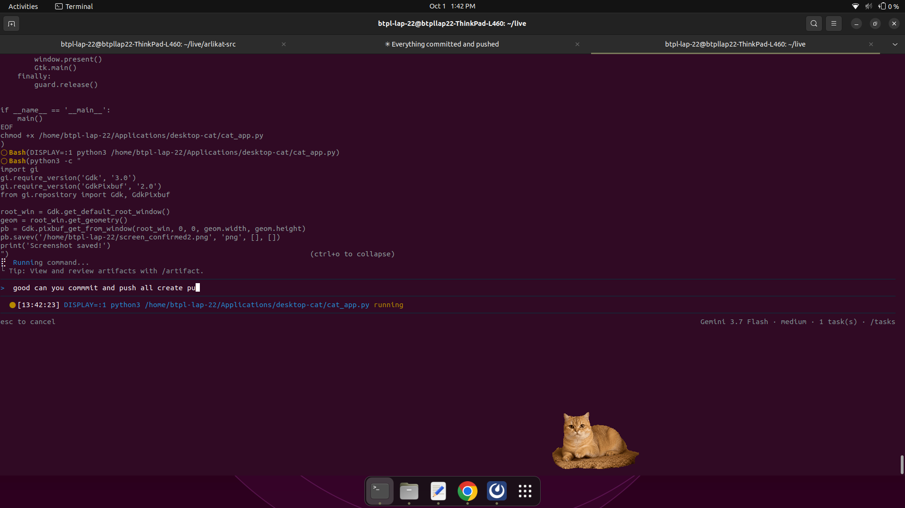

# Real Desktop Cat 🐱🐾

An autonomous, photorealistic desktop cat companion for Linux (Ubuntu / GNOME / X11).



## ✨ Features

- 🐱 **100% Photorealistic Real Cats:** High-definition real cat animations with true per-pixel RGBA transparency.
- 🖱️ **Real-Time Mouse Cursor Tracking:** Senses your mouse movements and actively walks across your dock/screen to stay near where you are working.
- ⌨️ **Keyboard Typing & Coding Reactions:** Detects active keyboard typing in real time and cheers you on with cute focus animations and encouragement.
- 📸 **100+ Real Cat Gallery:** Includes a built-in library of over 100+ real cat photos and animations.
- 🤖 **100% Autonomous:** Automatically cycles between resting on its mat, roaming, alert observing, and grooming.
- 🔒 **Single-Instance Mutex:** Uses kernel file locking (`fcntl.flock`) to guarantee duplicate instances never collide.

---

## 🚀 Installation & Running

### Requirements (Ubuntu / Debian)
```bash
sudo apt update
sudo apt install -y python3-gi python3-cairo gir1.2-gtk-3.0
```

### Run
```bash
python3 cat_app.py &
```

---

## 🎮 Controls & Interactions

- **Left-Click & Drag:** Move the cat anywhere along your dock or windows.
- **Double-Click:** Pet the cat to trigger happy purrs and heart reactions.
- **Right-Click Menu:**
  - 🖱️ **Toggle Mouse Following:** Turn real-time cursor tracking on/off.
  - 📸 **Random 100+ Cat Gallery:** Cycle through 100+ real cats.
  - 🐟 **Feed Tuna Fish:** Give your cat a treat.
  - 🐱 **Choose Real Cat Breed:** Switch between *Golden Tabby, Fluffy Longhair, Ragdoll, Tuxedo, Bengal, or Exotic Shorthair*.
  - ❌ **Close Cat:** Exit cleanly.

---

## 🏗️ Clean Code Architecture

- **`SingleInstanceGuard`:** File locking mutex to ensure single-process execution.
- **`X11KeyboardDetector`:** Real-time low-level X11 keymap query via `ctypes` (zero root/sudo required).
- **`AutonomousCatBrain`:** Probabilistic state machine handling pacing, mouse following distance thresholds, and typing cheer triggers.
- **`DesktopCatWindow`:** GTK3 + Cairo composited transparent window running on a 30 FPS non-blocking GLib event loop.

---

## 📄 License
MIT License
