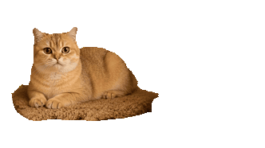

# Real Desktop Cat 🐱🐾

An autonomous, photorealistic desktop cat companion for Linux (GNOME / X11 / Wayland).



## ✨ Features

- **Photorealistic Animations:** Real, high-definition cat animations (resting on mat, grooming, standing, observing, and lounging).
- **100% Autonomous:** Automatically cycles between resting, roaming, and grooming across your screen and dock without requiring manual clicks.
- **Smart Mouse Cursor Following:** Senses where your cursor is working on screen and smoothly walks over to keep you company.
- **True Transparency:** Per-pixel RGBA transparency floating above desktop windows and taskbars.
- **Single-Instance Mutex:** Built-in kernel file locking to guarantee only one companion runs at a time.
- **Interactive:**
  - Double-click to pet with purrs and hearts.
  - Left-click drag to reposition anywhere.
  - Right-click menu to feed tuna, toggle mouse following, or switch cat breeds.

## 🚀 Installation & Running

### Requirements (Ubuntu / Debian)
```bash
sudo apt update
sudo apt install -y python3-gi python3-cairo gir1.2-gtk-3.0
```

### Run
```bash
python3 cat_app.py
```

## 🐱 Available Real Cat Breeds
- Golden Tabby Cat (Resting on Mat)
- Fluffy Longhair Cat
- Ragdoll Cat
- Tuxedo Mustache Cat
- Bengal Leopard Cat
- Exotic Shorthair Cat

## 📄 License
MIT License
