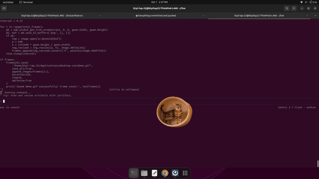

# Real Desktop Cat 🐱🐾

An autonomous, photorealistic desktop cat companion for Linux (Ubuntu / GNOME / X11).



---

## 📸 Desktop Preview


---

## ✨ Features

- 🐱 **100% Photorealistic Real Cats:** High-definition real cat animations and photos with true per-pixel RGBA transparency.
- 🖱️ **Full 2D Screen Tracking (X & Y Axes):** Senses your mouse cursor across the entire screen and gently walks to stay nearby with ergonomic offset.
- 🐢 **Ultra-Gentle, Natural Pacing:** Smooth deceleration easing and relaxed pacing mimicking real cat strolls (with customizable speeds: *Ultra Gentle Stroll, Lazy Sloth Meander, Light Walk*).
- 📸 **115+ Real Cat Photo & Animation Gallery:** Built-in auto-cycling slideshow every 18 seconds featuring 115+ real cat breeds and moments.
- ⌨️ **Live Keyboard Typing & Coding Reactions:** Detects active keyboard typing in real time across any window and cheers you on with cute bongo paws and encouragement.
- 🤖 **100% Autonomous:** Automatically cycles between resting on its mat, roaming, alert observing, and cheering.
- 🔒 **Single-Instance Mutex:** Uses kernel file locking (`fcntl.flock`) to guarantee duplicate instances never collide.

---

## 🚀 Quick Start (Ubuntu / Debian)

### 1. Install System Dependencies
```bash
sudo apt update
sudo apt install -y python3-gi python3-cairo gir1.2-gtk-3.0 python3-pil
```

### 2. Run Desktop Cat
```bash
DISPLAY=:1 python3 cat_app.py &
```

---

## 🎮 Controls & Interactions

| Action | Result |
|---|---|
| **Left-Click & Drag** | Move the cat anywhere across your desktop or windows |
| **Double-Click** | Cycle to the next cat photo from the 115+ gallery and purr! |
| **Middle-Click** | Instantly load the next gallery cat photo |
| **Right-Click Menu** | Open full feature control panel |

### 🎛️ Right-Click Menu Options:
- 🖱️ **Full 2D Mouse Cursor Following:** Toggle screen-wide cursor following ON/OFF.
- 🐾 **Walking Pace / Speed:**
  - 🐾 *Ultra Gentle Stroll* (Default — Slow & Cute)
  - 🍃 *Lazy Sloth Meander* (Super Slow)
  - 🚶 *Light Walk*
- 📸 **115+ Real Cat Gallery:**
  - `Next Cat Photo ➡️`
  - `Previous Cat Photo ⬅️`
  - `Random Cat Photo 🎲`
  - `Auto-Cycle Photos (Every 18s) ⏱️` *(Toggle auto-slideshow)*
- ❤️ **Pet Cat:** Trigger happy purring and heart bubbles.
- 🐟 **Feed Tuna Fish:** Treat your companion to fresh tuna snack.
- 🐱 **Choose Animated Cat Breed:** Switch between *Golden Tabby (on Mat), Fluffy Longhair, Ragdoll, Tuxedo Mustache, Bengal Leopard, or Exotic Shorthair*.
- ❌ **Close Cat:** Clean exit and lock release.

---

## 🏗️ Clean Modular Architecture

- **`SingleInstanceGuard`:** File locking mutex to ensure single-process execution.
- **`X11KeyboardDetector`:** Real-time low-level X11 keymap query via `ctypes` (`libX11.so.6` `XQueryKeymap`, zero root/sudo required).
- **`AutonomousCatBrain`:** Full 2D Euclidean vector state machine handling pacing, relaxed distance thresholds, and typing cheer triggers.
- **`DesktopCatWindow`:** GTK3 + Cairo composited transparent window running on a 30 FPS non-blocking GLib event loop with auto-rotating gallery integration.

---

## 📄 License
MIT License
